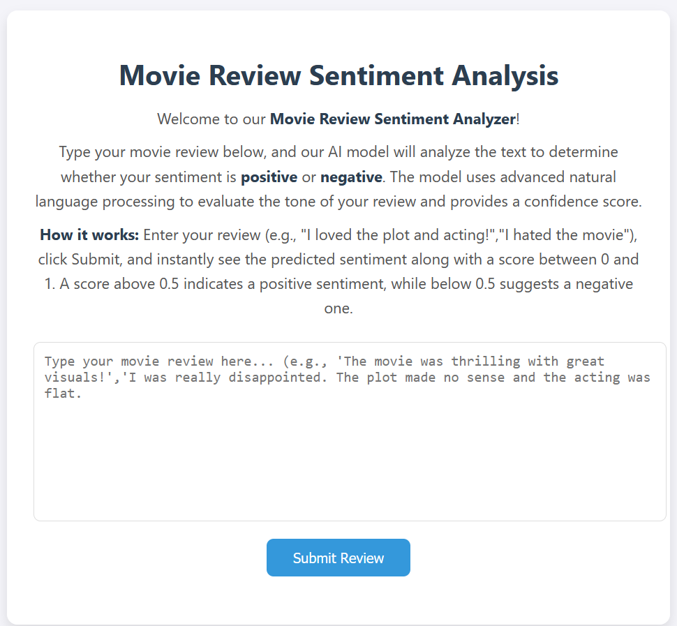

# 🎬 Movie Review Sentiment Analysis

A web application that uses deep learning and natural language processing to classify movie reviews as **positive** or **negative** sentiment with a confidence score. This project demonstrates the full pipeline from model training to deployment with a user-friendly Flask web interface.
> 🔗 *Demo:* [Movie Review Sentiment Analyzer](https://adamderbel.github.io/Adam-Portfolio/movie-sentiment.html)

---

## 🚀 Features
- 🔍 Sentiment classification of movie reviews into **Positive** or **Negative**
- 📊 Confidence score indicating the prediction certainty
- 🖥️ Responsive and clean web UI with real-time prediction
- 📚 Trained on IMDb dataset with 15,000 vocabulary size and 100-dimensional GloVe embeddings
- 🐳 Dockerfile included for containerized deployment

---

## 📸 Demo


---

## 📂 Project Structure
```
📁 movie-review-sentiment-analysis/
├── app.py                  # Flask application
├── train_model.py          # Model training script
├── model.keras             # Saved trained Keras model
├── tokenizer.pkl           # Saved tokenizer using joblib
├── glove.6B.100d.txt       # Pretrained GloVe embeddings file
├── requirements.txt        # Python dependencies
├── Dockerfile              # Docker container build instructions
├── templates/
│   └── index.html          # Frontend HTML template
└── README.md               # Project documentation
```

---

## 🖥️ Setup Instructions

### 1. Clone the Repository
```bash
git clone https://github.com/yourusername/movie-review-sentiment-analysis.git
cd movie-review-sentiment-analysis
```

### 2. Create Virtual Environment
```bash
python -m venv venv
source venv/bin/activate  # On Windows: venv\Scripts\activate
```

### 3. Install Dependencies
```bash
pip install -r requirements.txt
```

### 4. Download GloVe Embeddings
Download `glove.6B.100d.txt` from [GloVe](https://nlp.stanford.edu/projects/glove/) and place it in the project root.

### 5. Train the Model
```bash
python train.py
```

### 6. Run the App
```bash
python app.py
```
Access the app at [http://localhost:7860](http://localhost:7860).

---

## 💻 Usage
- Enter a movie review in the web interface's textarea.
- Click **Submit Review**.
- View the predicted sentiment (Positive/Negative) and confidence score.
- Enjoy input validation and a loading spinner for a smooth experience.

---

## 🐳 Docker Deployment

### Using Your Own Docker Image
1. Build the Docker image:
   ```bash
   docker build -t movie-sentiment-app .
   ```
2. Run the container:
   ```bash
   docker run -d -p 7860:7860 movie-sentiment-app
   ```
3. Access the app at [http://localhost:7860](http://localhost:7860).

### Using the Prebuilt Docker Image from Docker Hub
1. Pull the image:
   ```bash
   docker pull adamder/sentiment-analyzer:latest
   ```
2. Run the container:
   ```bash
   docker run --name sa -d -p 7860:7860 adamder/sentiment-analyzer:latest
   ```
3. Access the app at [http://localhost:7860](http://localhost:7860).

---

## 🧪 Model Details
- **Dataset**: IMDb movie reviews (train and test splits)
- **Vocabulary Size**: 15,000 words
- **Embedding Dimension**: 100 (GloVe embeddings)
- **Architecture**:
  - Embedding layer (pretrained GloVe weights)
  - Bidirectional LSTM (128 units, return sequences)
  - Dropout (0.2)
  - LSTM (64 units)
  - Dropout (0.2)
  - Dense output layer (sigmoid activation)
- **Loss**: Binary Cross-Entropy
- **Optimizer**: Adam
- **Training**: Early stopping to prevent overfitting

---

## 🛠️ Troubleshooting
- **Model not loading**: Ensure `model.keras` and `tokenizer.pkl` are in the project root.
- **GloVe file missing**: Download `glove.6B.100d.txt` from [GloVe](https://nlp.stanford.edu/projects/glove/).
- **Port conflict**: Change the port in `app.py` or Docker run command (e.g., `-p 8000:7860`).
- **Dependencies error**: Verify Python 3.11 and reinstall dependencies with `pip install -r requirements.txt`.

---


